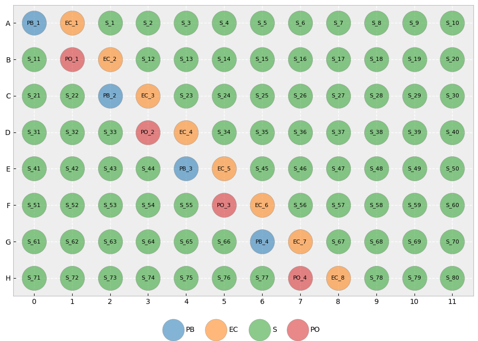
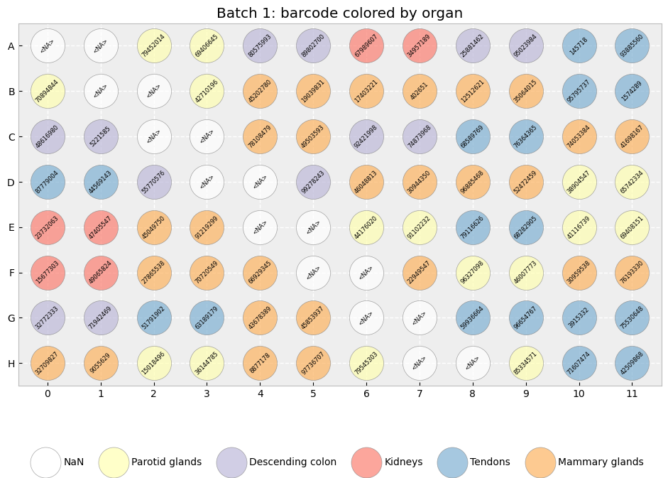

# plate_layout

[](https://pypi.org/project/plate-layout)
[](https://pypi.org/project/plate-layout)

-----

**Table of Contents**

- [Installation](#installation)
- [License](#license)
- [Example](#example)

## Installation

```console
pip install plate-layout
```

## License

`plate-layout` is distributed under the terms of the [MIT](https://spdx.org/licenses/MIT.html) license.

### TODO
- Turn into package using hatch
- Write a test suite
- Describe the toml config file in more detail
- Add python script and a main function for CLI usage ...

## Example

### Defining the plate type and quality control setup
The plate dimensions and (optional) quality control layouts are are defined in a toml file; see `plate_config.toml' in the config folder for an example. 


```python

import plate_layout as pl
import pandas as pd
import numpy as np
import logging

pl.logger.setLevel(logging.INFO)
```

### Create a plate layout 
Create plate design by specifying the path to a config file directly when instantiating the class, 


```python
pl.Plate("./config/plate_config.toml")
```

    [    INFO] --- Successfully loaded config file ./config/plate_config.toml
    [    INFO] --- Created a plate with 96 wells: 
     [['A0' 'A1' 'A2' 'A3' 'A4' 'A5' 'A6' 'A7' 'A8' 'A9' 'A10' 'A11']
     ['B0' 'B1' 'B2' 'B3' 'B4' 'B5' 'B6' 'B7' 'B8' 'B9' 'B10' 'B11']
     ['C0' 'C1' 'C2' 'C3' 'C4' 'C5' 'C6' 'C7' 'C8' 'C9' 'C10' 'C11']
     ['D0' 'D1' 'D2' 'D3' 'D4' 'D5' 'D6' 'D7' 'D8' 'D9' 'D10' 'D11']
     ['E0' 'E1' 'E2' 'E3' 'E4' 'E5' 'E6' 'E7' 'E8' 'E9' 'E10' 'E11']
     ['F0' 'F1' 'F2' 'F3' 'F4' 'F5' 'F6' 'F7' 'F8' 'F9' 'F10' 'F11']
     ['G0' 'G1' 'G2' 'G3' 'G4' 'G5' 'G6' 'G7' 'G8' 'G9' 'G10' 'G11']
     ['H0' 'H1' 'H2' 'H3' 'H4' 'H5' 'H6' 'H7' 'H8' 'H9' 'H10' 'H11']]
    [    INFO] --- Setting up QC scheme from config file
    [    INFO] --- Distributing specimen and QC samples on plate 
    [    INFO] --- 
    	[['PB_1' 'EC_1' 'S_1' 'S_2' 'S_3' 'S_4' 'S_5' 'S_6' 'S_7' 'S_8' 'S_9' 'S_10']
     ['S_11' 'PO_1' 'EC_2' 'S_12' 'S_13' 'S_14' 'S_15' 'S_16' 'S_17' 'S_18' 'S_19' 'S_20']
     ['S_21' 'S_22' 'PB_2' 'EC_3' 'S_23' 'S_24' 'S_25' 'S_26' 'S_27' 'S_28' 'S_29' 'S_30']
     ['S_31' 'S_32' 'S_33' 'PO_2' 'EC_4' 'S_34' 'S_35' 'S_36' 'S_37' 'S_38' 'S_39' 'S_40']
     ['S_41' 'S_42' 'S_43' 'S_44' 'PB_3' 'EC_5' 'S_45' 'S_46' 'S_47' 'S_48' 'S_49' 'S_50']
     ['S_51' 'S_52' 'S_53' 'S_54' 'S_55' 'PO_3' 'EC_6' 'S_56' 'S_57' 'S_58' 'S_59' 'S_60']
     ['S_61' 'S_62' 'S_63' 'S_64' 'S_65' 'S_66' 'PB_4' 'EC_7' 'S_67' 'S_68' 'S_69' 'S_70']
     ['S_71' 'S_72' 'S_73' 'S_74' 'S_75' 'S_76' 'S_77' 'PO_4' 'EC_8' 'S_78' 'S_79' 'S_80']]


    <plate_layout.plate.Plate at 0x7f55884dc280>


or use the methods


```python
P = pl.Plate()

P.load_config_file("./config/plate_config.toml")
P.create_layout()
P.plot_layout()
```

    [    INFO] --- Run method 'load_config_file(<path to config toml file)' to define the plate setup
    [    INFO] --- Successfully loaded config file ./config/plate_config.toml
    [    INFO] --- Created a plate with 96 wells: 
     [['A0' 'A1' 'A2' 'A3' 'A4' 'A5' 'A6' 'A7' 'A8' 'A9' 'A10' 'A11']
     ['B0' 'B1' 'B2' 'B3' 'B4' 'B5' 'B6' 'B7' 'B8' 'B9' 'B10' 'B11']
     ['C0' 'C1' 'C2' 'C3' 'C4' 'C5' 'C6' 'C7' 'C8' 'C9' 'C10' 'C11']
     ['D0' 'D1' 'D2' 'D3' 'D4' 'D5' 'D6' 'D7' 'D8' 'D9' 'D10' 'D11']
     ['E0' 'E1' 'E2' 'E3' 'E4' 'E5' 'E6' 'E7' 'E8' 'E9' 'E10' 'E11']
     ['F0' 'F1' 'F2' 'F3' 'F4' 'F5' 'F6' 'F7' 'F8' 'F9' 'F10' 'F11']
     ['G0' 'G1' 'G2' 'G3' 'G4' 'G5' 'G6' 'G7' 'G8' 'G9' 'G10' 'G11']
     ['H0' 'H1' 'H2' 'H3' 'H4' 'H5' 'H6' 'H7' 'H8' 'H9' 'H10' 'H11']]
    [    INFO] --- Setting up QC scheme from config file
    [    INFO] --- Distributing specimen and QC samples on plate 
    [    INFO] --- 
    	[['PB_1' 'EC_1' 'S_1' 'S_2' 'S_3' 'S_4' 'S_5' 'S_6' 'S_7' 'S_8' 'S_9' 'S_10']
     ['S_11' 'PO_1' 'EC_2' 'S_12' 'S_13' 'S_14' 'S_15' 'S_16' 'S_17' 'S_18' 'S_19' 'S_20']
     ['S_21' 'S_22' 'PB_2' 'EC_3' 'S_23' 'S_24' 'S_25' 'S_26' 'S_27' 'S_28' 'S_29' 'S_30']
     ['S_31' 'S_32' 'S_33' 'PO_2' 'EC_4' 'S_34' 'S_35' 'S_36' 'S_37' 'S_38' 'S_39' 'S_40']
     ['S_41' 'S_42' 'S_43' 'S_44' 'PB_3' 'EC_5' 'S_45' 'S_46' 'S_47' 'S_48' 'S_49' 'S_50']
     ['S_51' 'S_52' 'S_53' 'S_54' 'S_55' 'PO_3' 'EC_6' 'S_56' 'S_57' 'S_58' 'S_59' 'S_60']
     ['S_61' 'S_62' 'S_63' 'S_64' 'S_65' 'S_66' 'PB_4' 'EC_7' 'S_67' 'S_68' 'S_69' 'S_70']
     ['S_71' 'S_72' 'S_73' 'S_74' 'S_75' 'S_76' 'S_77' 'PO_4' 'EC_8' 'S_78' 'S_79' 'S_80']]


    Number of colors to use: 4


    

    


### Load study data and randomize order 


```python
datapath = "data/fake_case_control_Npairs_523_Ngroups_5.csv"
study = pd.read_csv(datapath, index_col=0)

study.set_index(["pair_ID", "specimen_ID"], inplace=True)
study.head()
```


<table border="1" class="dataframe">
  <thead>
    <tr style="text-align: right;">
      <th></th>
      <th></th>
      <th>object</th>
      <th>date_of_birth</th>
      <th>barcode</th>
      <th>organ</th>
    </tr>
    <tr>
      <th>pair_ID</th>
      <th>specimen_ID</th>
      <th></th>
      <th></th>
      <th></th>
      <th></th>
    </tr>
  </thead>
  <tbody>
    <tr>
      <th rowspan="2" valign="top">0</th>
      <th>888</th>
      <td>Control</td>
      <td>1993-12-13</td>
      <td>95388762</td>
      <td>Parotid glands</td>
    </tr>
    <tr>
      <th>889</th>
      <td>Case</td>
      <td>1993-12-13</td>
      <td>66794295</td>
      <td>Parotid glands</td>
    </tr>
    <tr>
      <th rowspan="2" valign="top">1</th>
      <th>962</th>
      <td>Control</td>
      <td>2006-06-22</td>
      <td>69215322</td>
      <td>Tendons</td>
    </tr>
    <tr>
      <th>963</th>
      <td>Case</td>
      <td>2006-06-22</td>
      <td>77642424</td>
      <td>Tendons</td>
    </tr>
    <tr>
      <th>2</th>
      <th>261</th>
      <td>Control</td>
      <td>1999-05-06</td>
      <td>30225664</td>
      <td>Parotid glands</td>
    </tr>
  </tbody>
</table>
</div>


```python
# n_pairs = samples_df['Study_pair_ID'].max()
group_IDs = np.unique(study.index.get_level_values(0))

# Permute order in table
permutation_order = np.random.permutation(group_IDs)
study_permuted = study.loc[permutation_order].reset_index()
```

### Batches - distributing samples on plates


```python
P.create_batches(study_permuted)

```

    [    INFO] --- Finished distributing samples onto plates; 15 batches created.


### Export batch lists to file
You can export batch lists using the `to_file` method and specify desired file format and which columns to export. 


```python
columns = ["well_name", "sample_name", "barcode"]

for i,batch in enumerate(P.batches_df):
    P.to_file(fileformat="csv", folder_path=f"data/", write_columns=columns)
```


    [    INFO] --- Saving batch 0 to data/batch_1.csv 
    [    INFO] --- Saving batch 1 to data/batch_2.csv 
    [    INFO] --- Saving batch 2 to data/batch_3.csv 
    [    INFO] --- Saving batch 3 to data/batch_4.csv 
    [    INFO] --- Saving batch 4 to data/batch_5.csv 
    [    INFO] --- Saving batch 5 to data/batch_6.csv 
    [    INFO] --- Saving batch 6 to data/batch_7.csv 
    [    INFO] --- Saving batch 7 to data/batch_8.csv 
    [    INFO] --- Saving batch 8 to data/batch_9.csv
    ...


### Plot plate layouts

```python
Pfig = P.plot_batch(0, "specimen_ID", "organ", label_dtype="Int64")
```

    Number of colors to use: 6


    

    


```python
Pfig = P.plot_batch(0, "barcode", "organ", label_dtype="Int64", rotation=45, fontsize=6)

```

    Number of colors to use: 6


    

    


