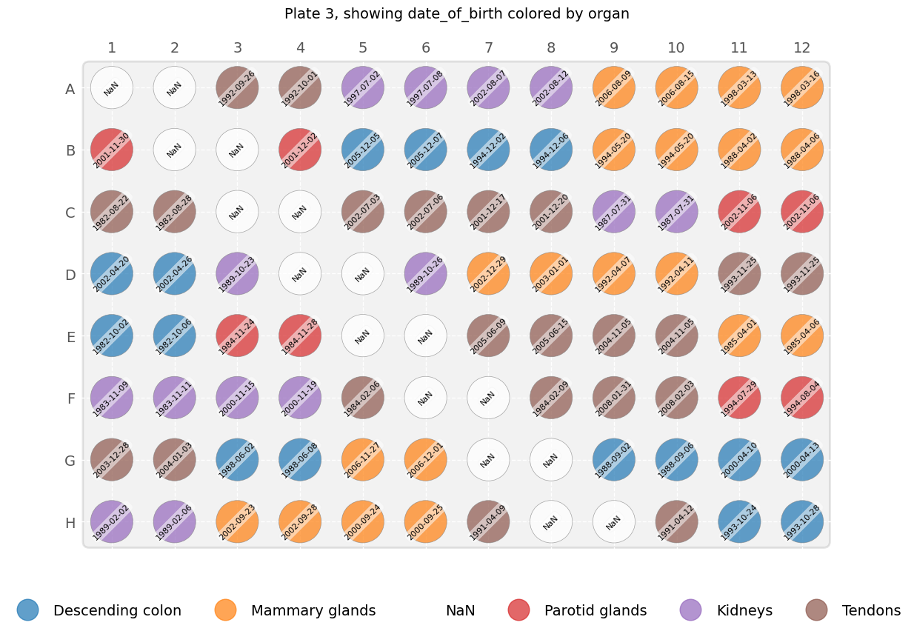
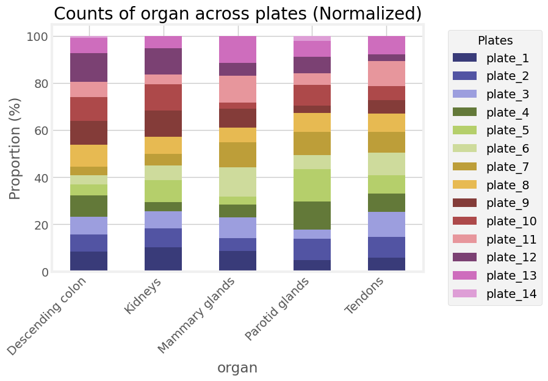

# Easy Plate Layouts for LC-MS Studies and Beyond
PlatePlanner is a Python package designed to simplify plate layout creation for LC-MS studies, and is also applicable for various laboratory applications where sample distribution to plates is required, with or without QC sample patterns. Its user-friendly API supports dynamic QC sample patterns, easy creation of run lists, and plate visualizations.

## Key features 
- **Dynamic QC Sample Patterns**: Create plate layouts with customizable QC sample patterns.
- **Flexible Sample Distribution**: Distribute samples within groups across plates, accommodating variable numbers of samples per group.
- **Non-Split/Split Group Handling**: Control over distributing samples within groups without splitting them over plates or splitting when necessary.
- **Customizable Run Lists & Plate Visualizations**: Generate run lists and visualize plate assignments.
- **Block Randomization**: Perform sample randomizaition or sample block randomization to prevent run order bias.

## Installation

```
pip install plate-planner
```

## Example
Here's a quick guide to using PlatePlanner:


```py
from plate-planner import Study, QCPlate

# Create a study and load your file with sample records (csv, xls/xlsx)
study_with_qc = Study(name="cancer")
study_with_qc.load_specimen_records(
    records_file="./data/study_samples.csv",
    sample_group_id_column="pair_ID",
    sample_id_column="specimen_ID"
)

# Block randomize groups
study_with_qc.randomize_order(case_control=True, reproducible=False)

# Distribute samples to a 96-well plate with QC samples as defined in the toml file
qc_plate = QCPlate(plate_dim=(8, 12), QC_config="./data/plate_config_dynamic.toml")
study_with_qc.distribute_samples_to_plates(plate_layout=qc_plate)

# Create visualization for plate 3
fig = study_with_qc[2].as_figure(
    color_metadata_key="organ",
    annotation_metadata_key="date_of_birth",
    rotation=45,
    )

#mshow distribution of sample attribute across all plates
fig = study_with_qc.plot_attribute_plate_distributions(attribute="organ", normalize=True, plt_style="fivethirtyeight")

```

## Visualization Examples
Here are some examples of plate visualizations created using PlatePlanner:






